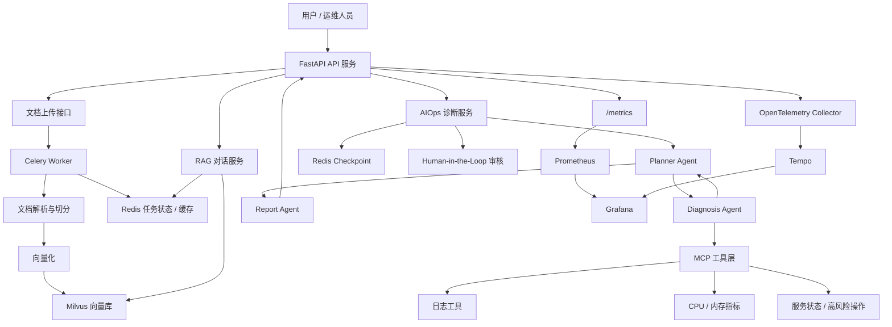

# 智能运维 Copilot 平台

面向企业运维场景的 AI Copilot 后端平台，整合知识库问答、智能对话、告警诊断、日志查询、监控指标查询、服务状态检查和结构化故障报告生成能力。项目目标是把传统排障中“反复查告警、查日志、查监控、翻文档、靠经验判断”的链路收敛到一个可观测、可恢复、可审核的智能诊断工作流中。

项目后端基于 FastAPI，知识库使用 Celery 异步完成文档解析、切分、向量化和 Milvus 索引构建；Agent 侧使用 LangChain、LangGraph、MCP 和多 Agent 协作实现计划生成、诊断执行、动态重规划和报告输出；同时补充了 Redis Checkpoint、人工审核、工具权限控制、失败重试、熔断降级、Prometheus / OpenTelemetry / Grafana 可观测性与 RAGAS 评测。

## 核心能力

- 知识库问答：上传运维文档、故障案例、Runbook，构建 Milvus 向量索引后支持 RAG 检索问答。
- 异步索引构建：文档上传后通过 Celery Worker 后台处理，Redis 管理任务状态。
- 智能对话：支持普通问答与 SSE 流式对话，保留多轮会话上下文。
- AIOps 故障诊断：根据告警上下文自动规划诊断步骤，调用日志、CPU、内存、服务状态等 MCP 工具收集证据。
- 真正 Multi-Agent：拆分 Planner Agent、Diagnosis Agent、Report Agent，通过结构化消息和共享状态协作。
- 动态重规划：Planner 根据中间证据判断继续执行、修改计划或进入报告阶段。
- Human-in-the-Loop：遇到重启服务等高风险操作时中断工作流，等待人工审批后继续。
- 工具安全控制：基于操作员角色、工具风险等级和白名单限制工具调用。
- 状态持久化与故障恢复：LangGraph Checkpoint 优先使用 Redis，失败时降级到内存。
- 可观测性：暴露 Prometheus 指标，接入 OpenTelemetry、Tempo、Grafana 观察 HTTP、Agent 工作流、工具调用和耗时。
- RAGAS 评测：提供检索命中、答案相关性、忠实度等评测入口。

## 技术栈

| 类别 | 技术 |
|---|---|
| Web 后端 | FastAPI、Uvicorn、Pydantic |
| Agent 编排 | LangChain、LangGraph、ReAct、Multi-Agent、Tool Calling |
| 工具接入 | MCP、FastMCP |
| 知识库 | RAG、Milvus、DashScope Embedding |
| 异步任务 | Celery、Redis |
| 状态与缓存 | Redis、LangGraph Checkpoint |
| 可靠性 | Tenacity、超时控制、重试、熔断降级 |
| 可观测性 | Prometheus、OpenTelemetry、Tempo、Grafana |
| 评测 | RAGAS |
| 工程化 | Docker、Docker Compose、pytest、ruff |

## 架构概览



## Multi-Agent 诊断流程

本项目不是简单把 LangGraph 切成几个普通节点，而是把诊断职责拆成了三个有明确边界的 Agent：

1. Planner Agent

   负责理解诊断目标、生成排障计划，并根据 Diagnosis Agent 返回的证据决定是否继续执行、调整计划或进入报告阶段。

2. Diagnosis Agent

   一次只执行一个诊断步骤，调用 MCP 工具收集日志、监控指标、服务状态等证据。它不负责下结论，也不直接生成最终报告。

3. Report Agent

   只基于已有结构化证据生成故障报告，避免使用没有被 Diagnosis Agent 获取到的数据进行编造。

Agent 间通过 `AgentMessage`、`DiagnosisPlan`、`PlanStep`、`ExecutionEvidence`、`DiagnosticReport` 等结构化协议传递计划、证据、错误和报告。相关实现位于：

- `app/agent/aiops/contracts.py`
- `app/agent/aiops/planner_agent.py`
- `app/agent/aiops/diagnosis_agent.py`
- `app/agent/aiops/report_agent.py`
- `app/services/aiops_service.py`

更多说明见 [docs/multi-agent-architecture.md](docs/multi-agent-architecture.md)。

## 目录结构

```text
.
├── app/
│   ├── api/                  # FastAPI 路由：chat、upload、aiops、tasks、health
│   ├── agent/                # MCP Client 与 AIOps Multi-Agent 实现
│   ├── core/                 # Milvus、Redis Checkpoint、可观测性、可靠性组件
│   ├── models/               # Pydantic 请求/响应模型
│   ├── services/             # RAG、向量索引、文档切分、诊断服务
│   ├── tasks/                # Celery 应用与知识库异步任务
│   └── tools/                # 本地工具与知识库工具
├── aiops-docs/               # 示例运维文档
├── docs/                     # 架构说明与 Runbook
├── evaluation/               # RAGAS 评测数据与脚本
├── mcp_servers/              # 日志与监控 MCP Server
├── observability/            # Prometheus、Tempo、Grafana、OTel 配置
├── static/                   # 简单前端页面
├── tests/                    # 单元测试与集成测试
├── docker-compose.yml
├── Dockerfile
├── pyproject.toml
└── uv.lock
```

## 环境要求

- Python 3.11+
- Docker / Docker Compose
- uv，推荐用于依赖安装与锁文件管理
- DashScope API Key，用于大模型和向量化

如果你的 Docker 环境不支持 `docker compose` 子命令，可以使用旧版命令 `docker-compose`。本 README 中两个命令都可以按本机环境二选一。

## 环境变量

复制环境变量模板：

```powershell
Copy-Item .env.example .env
```

至少需要修改以下配置：

```env
DASHSCOPE_API_KEY=你的 DashScope Key
TENCENTCLOUD_SECRET_ID=你的腾讯云服务 ID
TENCENTCLOUD_SECRET_KEY=你的腾讯云服务 Key
OPS_API_KEY=用于高权限操作审核的长随机密钥
MINIO_ROOT_USER=自定义 MinIO 用户名
MINIO_ROOT_PASSWORD=自定义 MinIO 密码
GRAFANA_ADMIN_PASSWORD=Grafana 管理员密码
```

注意：`docker-compose.yml` 中 Milvus 会使用 `MINIO_ROOT_USER` 和 `MINIO_ROOT_PASSWORD` 连接 MinIO，二者必须一致。如果 MinIO 已启动但 Milvus `standalone` 启动失败，优先检查这两个值是否匹配。

## 使用 Docker Compose 启动

推荐使用 Docker Compose 启动完整平台，包括 FastAPI、Celery、Redis、Milvus、MinIO、etcd、MCP Server、Prometheus、OpenTelemetry Collector、Tempo 和 Grafana。

```powershell
docker-compose up --build -d
```

如果你的 Docker 支持新版 Compose：

```powershell
docker compose up --build -d
```

查看容器状态：

```powershell
docker-compose ps
```

查看 API 日志：

```powershell
docker-compose logs -f api
```

查看 Milvus 启动日志：

```powershell
docker-compose logs -f standalone
```

服务地址：

| 服务 | 地址 |
|---|---|
| 前端页面 | http://localhost:9900 |
| OpenAPI 文档 | http://localhost:9900/docs |
| 健康检查 | http://localhost:9900/health |
| Prometheus 指标 | http://localhost:9900/metrics |
| Prometheus | http://localhost:9090 |
| Grafana | http://localhost:3000 |
| Milvus | localhost:19530 |

## 本地开发启动

如果不使用完整 Docker Compose，也可以本地启动 API 与 Worker，但仍需要 Redis、Milvus 和 MCP Server。

安装依赖：

```powershell
uv sync --extra dev
```

启动 Milvus 单机依赖：

```powershell
docker-compose -f vector-database.yml up -d
```

启动 Redis：

```powershell
docker run --name aiops-redis-dev -p 6379:6379 -d redis:8.0-alpine
```

启动两个 MCP Server：

```powershell
uv run python mcp_servers/cls_server.py
```

另开一个终端：

```powershell
uv run python mcp_servers/monitor_server.py
```

Windows 本地启动 Celery Worker 推荐使用 `--pool=solo`：

```powershell
uv run celery -A app.tasks.celery_app:celery_app worker --loglevel=INFO --pool=solo
```

启动 FastAPI：

```powershell
uv run uvicorn app.main:app --host 0.0.0.0 --port 9900 --reload
```

## 接口测试

### 健康检查

```powershell
curl http://localhost:9900/health
```

### 上传文档并异步索引

仅支持 `.txt` 和 `.md` 文件，单文件默认最大 10 MB。

```powershell
curl.exe -X POST "http://localhost:9900/api/upload" `
  -F "file=@aiops-docs/cpu_high_usage.md"
```

返回示例：

```json
{
  "task_id": "xxx",
  "state": "PENDING",
  "status_url": "/api/tasks/xxx",
  "filename": "cpu_high_usage.md"
}
```

查询任务状态：

```powershell
curl http://localhost:9900/api/tasks/你的任务ID
```

### 普通知识库问答

```powershell
curl.exe -X POST "http://localhost:9900/api/chat" `
  -H "Content-Type: application/json" `
  -d '{ "Id": "session-001", "Question": "CPU 使用率过高应该如何排查？" }'
```

### 流式知识库问答

```powershell
curl.exe -N -X POST "http://localhost:9900/api/chat_stream" `
  -H "Content-Type: application/json" `
  -d '{ "Id": "session-001", "Question": "服务响应变慢有哪些常见原因？" }'
```

### AIOps 流式诊断

普通只读诊断：

```powershell
curl.exe -N -X POST "http://localhost:9900/api/aiops" `
  -H "Content-Type: application/json" `
  -d '{ "session_id": "incident-001" }'
```

管理员诊断，高风险操作需要提供操作密钥：

```powershell
curl.exe -N -X POST "http://localhost:9900/api/aiops" `
  -H "Content-Type: application/json" `
  -H "X-Operator-Role: admin" `
  -H "X-Operator-Key: 你的 OPS_API_KEY" `
  -d '{ "session_id": "incident-002" }'
```

当诊断流程返回 `approval_required` 时，使用审批接口恢复工作流：

```powershell
curl.exe -N -X POST "http://localhost:9900/api/aiops/incident-002/approval" `
  -H "Content-Type: application/json" `
  -H "X-Operator-Key: 你的 OPS_API_KEY" `
  -d '{ "approved": true, "reviewer": "oncall-admin", "reason": "已确认变更窗口" }'
```

## 测试与代码质量

运行测试：

```powershell
uv run pytest tests -q
```

如果希望跳过覆盖率参数，只看测试是否通过：

```powershell
uv run pytest tests -q -o addopts=''
```

运行 Ruff：

```powershell
uv run ruff check app tests evaluation mcp_servers
```

检查锁文件：

```powershell
uv lock --check
```

## RAGAS 评测

安装评测依赖：

```powershell
uv sync --extra evaluation
```

运行评测：

```powershell
uv run python -m evaluation.run_ragas
```

评测数据位于 `evaluation/dataset.jsonl`，报告默认写入 `evaluation/report.json`。RAGAS 评测通常需要可用的大模型与 Embedding 配置，运行前请确认 `.env` 中的模型密钥有效。

## 可观测性

平台默认暴露 Prometheus 指标：

```text
http://localhost:9900/metrics
```

Docker Compose 会额外启动：

- Prometheus：采集 API 指标和告警规则。
- OpenTelemetry Collector：接收 Trace。
- Tempo：存储 Trace。
- Grafana：展示 HTTP 请求量、p95 延迟、Agent 工作流耗时、工具调用成功率等面板。

Grafana 地址：

```text
http://localhost:3000
```

默认用户名为 `admin`，密码来自 `.env` 中的 `GRAFANA_ADMIN_PASSWORD`。

## 常见问题

### 1. MinIO 已启动，但 Milvus standalone 启动失败

优先检查 `.env` 中：

```env
MINIO_ROOT_USER=...
MINIO_ROOT_PASSWORD=...
```

以及 `docker-compose.yml` 中 Milvus 是否配置了：

```yaml
MINIO_ACCESS_KEY_ID: ${MINIO_ROOT_USER:?set MINIO_ROOT_USER}
MINIO_SECRET_ACCESS_KEY: ${MINIO_ROOT_PASSWORD:?set MINIO_ROOT_PASSWORD}
```

如果修改过凭证，重新创建 Milvus 容器：

```powershell
docker-compose up -d --force-recreate standalone
```

### 2. Docker 命令提示 `unknown command: docker compose`

说明本机 Docker 只支持旧版 Compose 命令，改用：

```powershell
docker-compose up --build -d
```

### 3. 文档上传成功但知识库问答搜不到内容

检查 Celery Worker 是否运行：

```powershell
docker-compose logs -f celery-worker
```

再检查任务状态：

```powershell
curl http://localhost:9900/api/tasks/你的任务ID
```

如果任务失败，通常需要检查 DashScope Key、Milvus 连接和文档格式。

## 相关文档

- [补充技术说明](docs/supplemental-technologies.md)
- [Multi-Agent 架构说明](docs/multi-agent-architecture.md)
- [AIOps API Runbook](docs/runbooks/aiops-api-errors.md)
- [工具失败 Runbook](docs/runbooks/tool-failures.md)
- [MCP Server 说明](mcp_servers/README.md)

